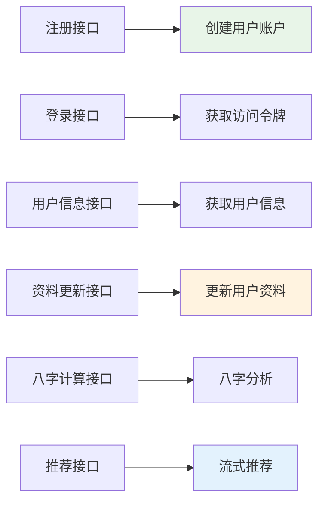
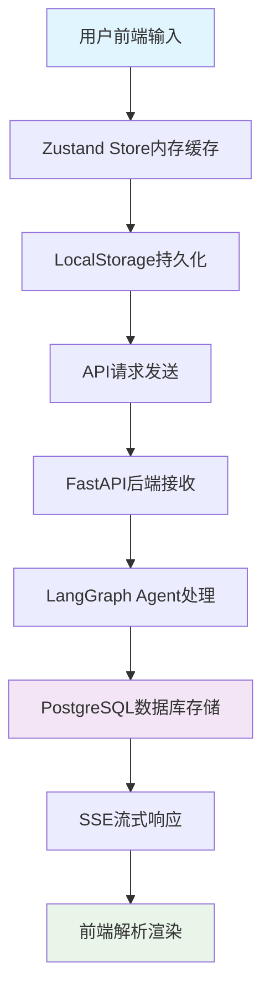
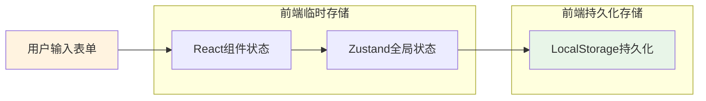
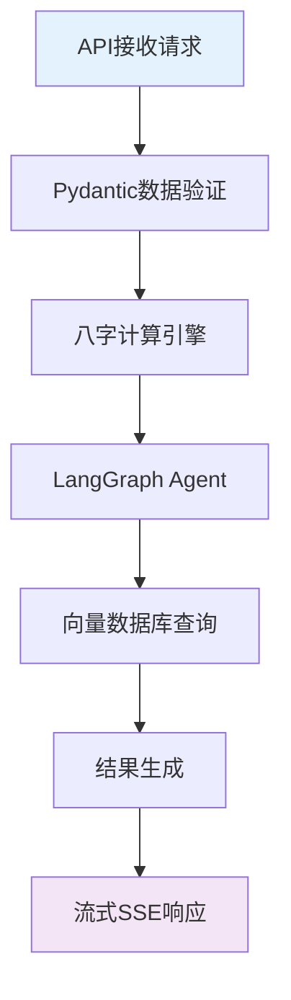
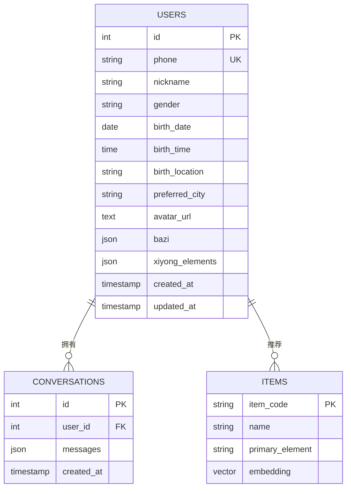
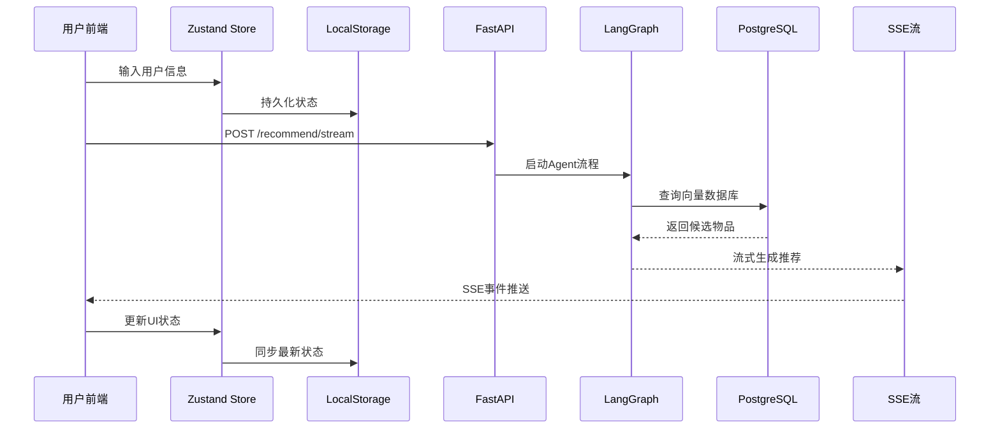
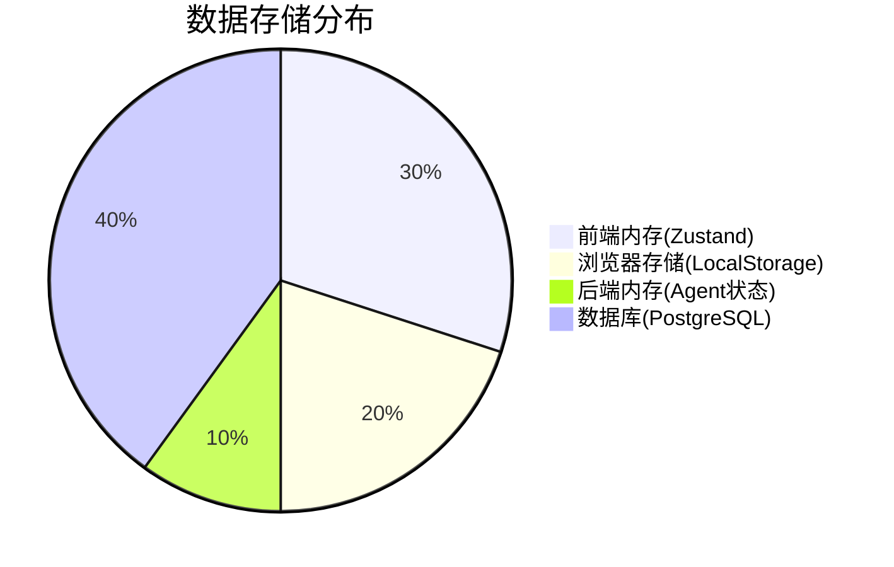
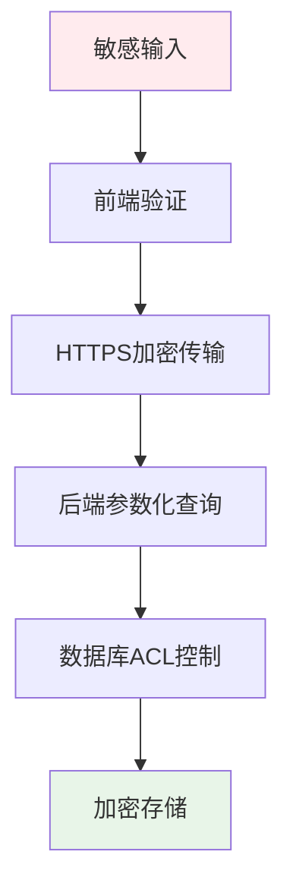

# 用户信息数据流向图

## 🎯 关键API端点

```mermaid
graph LR
    A[注册接口] --> B[创建用户账户]
    C[登录接口] --> D[获取访问令牌]
    E[用户信息接口] --> F[获取用户信息]
    G[资料更新接口] --> H[更新用户资料]
    I[八字计算接口] --> J[八字分析]
    K[推荐接口] --> L[流式推荐]
    
    style B fill:#e8f5e8
    style H fill:#fff3e0
    style L fill:#e3f2fd
```

## 📊 完整数据流架构

```mermaid
graph TD
    A[用户前端输入] --> B[Zustand Store内存缓存]
    B --> C[LocalStorage持久化]
    C --> D[API请求发送]
    D --> E[FastAPI后端接收]
    E --> F[LangGraph Agent处理]
    F --> G[PostgreSQL数据库存储]
    G --> H[SSE流式响应]
    H --> I[前端解析渲染]
    
    style A fill:#e1f5fe
    style G fill:#f3e5f5
    style I fill:#e8f5e8
```

## 🔧 前端存储层详情

```mermaid
graph LR
    A[用户输入表单] --> B[React组件状态]
    B --> C[Zustand全局状态]
    C --> D[LocalStorage持久化]
    
    subgraph "前端临时存储"
        B
        C
    end
    
    subgraph "前端持久化存储"
        D
    end
    
    style A fill:#fff3e0
    style D fill:#e8f5e8
```

## 🏗️ 后端处理流程

```mermaid
graph TD
    A[API接收请求] --> B[Pydantic数据验证]
    B --> C[八字计算引擎]
    C --> D[LangGraph Agent]
    D --> E[向量数据库查询]
    E --> F[结果生成]
    F --> G[流式SSE响应]
    
    style A fill:#e3f2fd
    style G fill:#f3e5f5
```

## 🗄️ 数据库存储结构

```mermaid
erDiagram
    USERS ||--o{ CONVERSATIONS : "拥有"
    USERS ||--o{ ITEMS : "推荐"
    
    USERS {
        int id PK
        string phone UK
        string nickname
        string gender
        date birth_date
        time birth_time
        string birth_location
        string preferred_city
        text avatar_url
        json bazi
        json xiyong_elements
        timestamp created_at
        timestamp updated_at
    }
    
    CONVERSATIONS {
        int id PK
        int user_id FK
        json messages
        timestamp created_at
    }
    
    ITEMS {
        string item_code PK
        string name
        string primary_element
        vector embedding
    }
```

## �� 完整数据流动时序

```mermaid
sequenceDiagram
    participant U as 用户前端
    participant F as Zustand Store
    participant L as LocalStorage
    participant A as FastAPI
    participant G as LangGraph
    participant D as PostgreSQL
    participant S as SSE流
    
    U->>F: 输入用户信息
    F->>L: 持久化状态
    U->>A: POST /recommend/stream
    A->>G: 启动Agent流程
    G->>D: 查询向量数据库
    D-->>G: 返回候选物品
    G-->>S: 流式生成推荐
    S-->>U: SSE事件推送
    U->>F: 更新UI状态
    F->>L: 同步最新状态
```

## 💾 存储类型对比

```mermaid
pie
    title 数据存储分布
    "前端内存(Zustand)" : 30
    "浏览器存储(LocalStorage)" : 20
    "后端内存(Agent状态)" : 10
    "数据库(PostgreSQL)" : 40
```

## 🔒 数据安全流向

```mermaid
graph TD
    A[敏感输入] --> B[前端验证]
    B --> C[HTTPS加密传输]
    C --> D[后端参数化查询]
    D --> E[数据库ACL控制]
    E --> F[加密存储]
    
    style A fill:#ffebee
    style F fill:#e8f5e8
```
